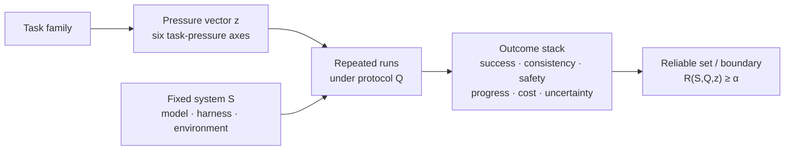

<h1 align="center">Building Reliable Long-Horizon Agents</h1>

<p align="center">
  <strong>Definitions, Metrics, Benchmarks, and System Design</strong>
  <br>
  The official companion repository from <strong>Simple Agent Lab</strong>.
  <br>
  An inspectable harness and evaluation workspace for studying how agent
  reliability changes as task pressure grows.
</p>

<p align="center">
  
  <a href="https://github.com/simple-agent-lab/simple-agent-lab/actions/workflows/ci.yml"></a>
  
  <a href="LICENSE"></a>
</p>

<p align="center">
  <a href="#paper-at-a-glance">Paper</a> ·
  <a href="#what-this-repository-provides">Artifacts</a> ·
  <a href="#quick-start">Quick start</a> ·
  <a href="#paper-to-code-map">Paper-to-code map</a> ·
  <a href="#reproducing-the-research">Reproduction</a> ·
  <a href="#citation">Citation</a>
</p>

---

Agent progress is not demonstrated by a larger action count or one fortunate
trajectory. Long-horizon execution begins when earlier actions create
information, state, constraints, or consequences that later decisions must
preserve and verify.

**Building Reliable Long-Horizon Agents: A Survey** studies the resulting
question: under a fixed model, harness, environment, and evaluation protocol,
how far can task pressure increase before an agent is no longer reliably
delegable?

This repository is the executable companion to that systems view. Its small
runtime keeps model calls, context policy, memory, tools, state transitions,
verification, and traces visible so that reliability claims can be inspected
and attributed instead of hidden behind a framework.

## Paper at a glance

The paper makes four organizing moves:

1. It defines long-horizon execution through **cross-step coupling**, not
   context length or wall-clock time alone.
2. It separates six **task-pressure axes** from the outcomes used to evaluate a
   system.
3. It treats reliability as a property of the complete
   **model–harness–environment–evaluation** stack.
4. It defines progress as a controlled outward shift of a reliable boundary
   under matched tasks, budgets, and verification—not as a single successful
   rollout.



### Six task-pressure axes

| Axis | What increases |
| --- | --- |
| Human-effort time | The qualified-human time needed to complete the task. |
| Interaction length | The number and dependency structure of actions, tool calls, or state transitions. |
| Context and memory demand | The volume, update frequency, and staleness risk of goal-relevant state. |
| Environment grounding | The difficulty of keeping intent, observations, actions, and mutable world state aligned. |
| Planning dependency | The depth of global constraints, ordering requirements, resource coupling, and delayed consequences. |
| Verification observability | The delay, sparsity, and localizability of correctness signals. |

A scalar “horizon” is meaningful only as a declared slice through these axes.
The paper instead centers the protocol-conditioned reliability surface and the
set of pressures for which reliability remains above a predeclared threshold.

## What this repository provides

Simple Agent Lab is the paper's reference harness and evaluation workbench. It
currently provides:

- an inspectable, message-first agent runtime with explicit state transitions;
- interchangeable model providers, tools, context policies, memory, and
  workflow controls for harness ablations;
- append-only events, spans, live traces, training views, token usage, and cost
  records;
- a shared benchmark runner with reproducible artifact layouts and official
  scorer integration where available;
- benchmark adapters for software engineering, terminal work, and
  rubric-judged agent workflows;
- deterministic local demos and tests for validating the infrastructure
  without an API key or external service.

### Research artifact status

| Artifact | Status | Where to start |
| --- | --- | --- |
| Reference agent runtime and harness | Available | [`src/simple_agent_lab/core.py`](src/simple_agent_lab/core.py) and [`src/simple_agent_lab/agents/`](src/simple_agent_lab/agents/README.md) |
| Context, compression, memory, and verification controls | Available | [`context_view.py`](src/simple_agent_lab/context_view.py), [`compression/`](src/simple_agent_lab/compression), [`memory/`](src/simple_agent_lab/memory), and [`goal_loop.py`](src/simple_agent_lab/workflow/goal_loop.py) |
| Replayable trajectories and run artifacts | Available | [`trace/`](src/simple_agent_lab/trace) and [`evals/out/README.md`](evals/out/README.md) |
| Unified benchmark execution | Available | [`runs/run_bench.py`](runs/run_bench.py) and [`evals/README.md`](evals/README.md) |
| Six-axis task annotations and matched stress paths | Planned | Release roadmap; definitions currently live in the paper |
| Reliability-surface and boundary estimation package | Planned | Release roadmap |
| Paper-scale repeated evaluation and intervention study | Planned | See [Reproducing the research](#reproducing-the-research) |

The status labels are deliberate. The repository already supplies the harness,
trace, and benchmark substrate, but it does **not** yet claim to reproduce the
paper's full reliable-horizon analysis.

## Quick start

Run a complete tool-using trajectory locally:

```bash
git clone https://github.com/simple-agent-lab/simple-agent-lab.git
cd simple-agent-lab
uv sync --group dev
bash runs/demos/run_bash_agent_demo.sh
```

The demo uses a fake provider, asks an agent to execute a bash command, and
prints its messages, tool events, trace, token usage, and cost summary. It needs
no API key, Docker daemon, or external service.

Discover the benchmark adapters exposed through the common runner:

```bash
uv run python runs/run_bench.py list
```

The current registry includes SWE-bench, ProgramBench, Harbor, and
OneMillion-Bench. Each adapter keeps benchmark-specific setup and scoring at
the edge while reusing the same runtime, trace, and artifact contracts.

To run a live OpenAI-compatible model, copy `.env.example` to `.env`, configure
`OPENAI_MODEL` and `OPENAI_AUTH_TOKEN` (plus `OPENAI_BASE_URL` when needed),
then run:

```bash
uv run python scripts/run_bash_agent_demo.py \
  --provider openai \
  --task "Inspect this repository and explain how it records verification evidence."
```

> Requires Python 3.10 or newer. The project uses
> [uv](https://docs.astral.sh/uv/) for reproducible environments.

## Paper-to-code map

The paper's four-layer stack is reflected in four visible repository
boundaries:

| Paper layer | Repository implementation | Research use |
| --- | --- | --- |
| **Model** | [`llm/`](src/simple_agent_lab/llm/README.md), [`messages.py`](src/simple_agent_lab/messages.py), and the [model registry](src/simple_agent_lab/llm/registry.py) | Hold the harness fixed while changing a provider or model role; record the exact model request boundary. |
| **Harness** | [`core.py`](src/simple_agent_lab/core.py), [`context_view.py`](src/simple_agent_lab/context_view.py), [`compression/`](src/simple_agent_lab/compression), [`memory/`](src/simple_agent_lab/memory), [`tools/`](src/simple_agent_lab/tools), and [`workflow/`](src/simple_agent_lab/workflow/README.md) | Isolate context, memory, planning, verification, recovery, and orchestration interventions. |
| **Environment** | [`src/simple_agent_lab/evals/backends/`](src/simple_agent_lab/evals/backends) and suite-specific host/container halves documented in [`evals/README.md`](evals/README.md) | Run the same agent contract in local, containerized, or remote executable environments. |
| **Evaluation** | [`evals/`](evals/README.md), [`trace/`](src/simple_agent_lab/trace), and the common [`run_bench.py`](runs/run_bench.py) entry point | Preserve task identity, configuration, trajectory, verifier output, final state, usage, and cost for later analysis. |

The reference runtime stays intentionally small:

```text
Agent + Message + State + build_context_view() + run()
```

That simplicity is part of the research method. A visible harness makes it
possible to say whether an observed boundary shift came from the model, context
policy, memory, verification loop, resource budget, or evaluator.

## Benchmarks

The paper surveys a much broader benchmark landscape. The repository currently
implements a focused executable subset:

| Adapter | Domain | Current role |
| --- | --- | --- |
| SWE-bench | Repository-level software engineering | Run issue-repair agents in benchmark containers and invoke the official scorer, including supported variants. |
| ProgramBench | Program reverse engineering | Execute observation–implementation–verification loops with benchmark-specific isolation and scoring artifacts. |
| Harbor | Terminal and containerized tasks | Run Harbor datasets through their native environment and verifier contracts. |
| OneMillion-Bench | Rubric-judged Q&A and multi-agent workflows | Compare single-agent and workflow configurations through one in-process suite contract. |

Use run profiles to make the agent configuration and resource budget explicit:

```bash
uv run python runs/run_bench.py swebench \
  --profile runs/profiles/swebench-loop.example.json \
  <instance-id>
```

Benchmark dependencies are optional. Normal development and deterministic
smoke checks do not require these datasets or Docker.

## Reproducing the research

The paper's empirical protocol is stricter than running a benchmark once. A
reliability claim should:

1. define an increasing stress path **within** a benchmark family;
2. hold the model, harness, tools, decoding, verifier, retry allowance, and
   resource budget fixed;
3. repeat each task and retain task-level uncertainty;
4. record the pressure vector, initial state, versions, seed, trajectory,
   verifier output, final state, tokens, tool calls, latency, retries, and cost;
5. estimate reliability by stress bin and report the reliable set or a
   robust-prefix boundary;
6. compare interventions on paired tasks and include sensitivity analyses for
   thresholds, binning, retries, and verifier choice.

The current artifact and trace formats cover much of step 4. The public
six-axis annotations, matched evaluation manifests, statistical analysis, and
paper-scale results are still being prepared. Until they land, this repository
should be treated as the **reference infrastructure and implementation
workspace**, not a completed reproduction package.

## Read the reference harness

The starter layer builds agents from the same runtime used by demos and evals:

```python
from simple_agent_lab.agents import make_agent
from simple_agent_lab.llm import provider_from_env
from simple_agent_lab.messages import text_of

provider = provider_from_env()
agent = make_agent(
    provider,
    cwd=".",
    read=True,
    general_purpose=True,
)

state, events = agent.run("Verify the repository's test command.", max_turns=10)

# The event iterator is lazy: consuming it advances the run.
for event in events:
    print(event.kind)

print(text_of(state.messages[-1].content))
```

`Agent.run()` enters the canonical loop in
[`core.py`](src/simple_agent_lab/core.py). Every turn appends messages and
events to the returned [`State`](src/simple_agent_lab/state.py), making the
trajectory available for inspection and evaluation.

For a bounded autonomous loop with evidence-based completion checks, run:

```bash
uv run python scripts/run_goal_loop_demo.py
```

## Repository map

| Path | Purpose |
| --- | --- |
| [`src/simple_agent_lab/`](src/simple_agent_lab) | Reference runtime, providers, harness controls, traces, and workflow primitives. |
| [`evals/`](evals/README.md) | Benchmark host adapters, official scoring edges, and artifact conventions. |
| [`runs/`](runs/README.md) | Reproducible demos, benchmark launchers, profiles, and the local CI gate. |
| [`tests/`](tests/README.md) | Deterministic infrastructure and behavior checks. |
| [`docs/decisions/`](docs/decisions/README.md) | Architectural decisions and research-engineering tradeoffs. |
| [`docs/agent-native/`](docs/agent-native/README.md) | Progressive context and validation map for coding agents. |

## Scope and release status

This is an active research repository accompanying a paper in preparation.

It is intended to become:

- the public landing page and artifact map for the paper;
- a reference implementation of its inspectable harness design;
- a reproducible workspace for matched long-horizon evaluations and
  intervention studies;
- a place to publish benchmark annotations, analysis code, and results as they
  are ready.

It is not:

- a new foundation model;
- a production-scale agent platform;
- a wrapper around every provider or benchmark;
- a leaderboard or evidence that any system already extends the reliable
  horizon;
- a complete paper-reproduction package yet.

## Development

Install the development environment and run the same gate used in CI:

```bash
uv sync --group dev --extra mcp
bash runs/dev/run_ci.sh
```

The gate checks formatting, linting, documentation links, generated references,
architecture boundaries, types, unit tests, and the deterministic public demo.
See [`docs/agent-native/development.md`](docs/agent-native/development.md) for
the individual commands and supported Python versions.

## Documentation

- [`docs/README.md`](docs/README.md) — human-facing documentation map.
- [`docs/agent-native/README.md`](docs/agent-native/README.md) — progressive
  loading map for coding agents.
- [`docs/decisions/README.md`](docs/decisions/README.md) — architecture decision
  records.
- [`CONTEXT.md`](CONTEXT.md) — shared vocabulary for runtime messages and the
  model boundary.
- [`evals/README.md`](evals/README.md) — benchmark and artifact contracts.

## Citation

The public paper URL will be added when the preprint is released. Until then,
please cite the working paper as:

```bibtex
@article{wu2026building,
  title   = {Building Reliable Long-Horizon Agents: A Survey},
  author  = {Wu, Kai and Lyu, Hao and Luo, Zhen and Wang, Chaofan and
             Ye, Siyu and Lin, Jinghao and Ji, Xiaozhong and Jiang, Boyuan and
             Ye, Yiwen and Wang, Zimu and Liu, Wenzhe and Wang, Ruobing and
             Cai, Kai and Wang, Shengzhi and Liu, Qingwen},
  year    = {2026},
  note    = {Preprint},
  url     = {https://github.com/simple-agent-lab/simple-agent-lab}
}
```

## Contributing

Contributions are welcome. Start with [`CONTRIBUTING.md`](CONTRIBUTING.md);
agent-assisted contributors should also read [`AGENTS.md`](AGENTS.md). Changes
should make their relationship to the paper explicit, preserve inspectability,
define a feedback signal before editing, and pass the local quality gate.

## License

Licensed under the [Apache License 2.0](LICENSE).
