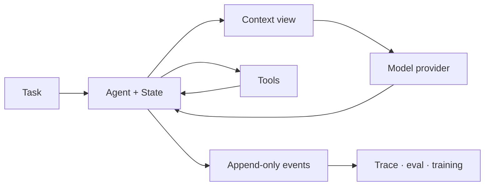

<h1 align="center">Simple Agent Lab</h1>

<p align="center">
  <strong>Learn agents by reading the loop—not by configuring a framework.</strong>
  <br>
  A small, inspectable Python lab for understanding, modifying, and evaluating
  agent systems.
</p>

<p align="center">
  <a href="https://github.com/simple-agent-lab/simple-agent-lab/actions/workflows/ci.yml"></a>
  
  <a href="LICENSE"></a>
</p>

<p align="center">
  <a href="#quick-start">Quick start</a> ·
  <a href="#how-it-works">How it works</a> ·
  <a href="#choose-your-path">Choose your path</a> ·
  <a href="docs/README.md">Docs</a> ·
  <a href="CONTRIBUTING.md">Contributing</a>
</p>

---

Most agent frameworks optimize for adding more. Simple Agent Lab optimizes for
making the important parts obvious:

```text
Agent + Message + State + build_context_view() + run()
```

The model call, tool execution, context projection, state transition, and trace
all remain visible in ordinary Python. Start with one deterministic demo, read
the runtime end to end, then swap in your own model, tools, workflow, or eval.

| Read it | Change it | Trust it |
| --- | --- | --- |
| One canonical message-first loop, with explicit data flow. | Providers, tools, context policies, skills, MCP, and workflows live at visible edges. | Deterministic demos, append-only traces, focused tests, and runnable eval adapters provide feedback. |

## Quick start

Run a complete tool-using agent locally:

```bash
git clone https://github.com/simple-agent-lab/simple-agent-lab.git
cd simple-agent-lab
uv sync --group dev
bash runs/demos/run_bash_agent_demo.sh
```

The demo uses a fake provider, asks an agent to run a bash command, and prints
the resulting messages, tool events, trace, token usage, and cost summary. It
needs no API key, Docker daemon, or external service.

To try a live OpenAI-compatible model, copy `.env.example` to `.env`, fill in
`OPENAI_MODEL` and `OPENAI_AUTH_TOKEN` (plus `OPENAI_BASE_URL` when needed),
then run:

```bash
uv run python scripts/run_bash_agent_demo.py \
  --provider openai \
  --task "Inspect this repository and explain its agent loop."
```

> Requires Python 3.10 or newer. The project uses
> [uv](https://docs.astral.sh/uv/) for reproducible environments.

## Read the loop

The starter layer builds an agent from the same small runtime used by the
demos and evals:

```python
from simple_agent_lab.agents import make_agent
from simple_agent_lab.llm import provider_from_env
from simple_agent_lab.messages import text_of

provider = provider_from_env()
agent = make_agent(
    provider,
    cwd=".",
    read=True,
    general_purpose=True,
)

state, events = agent.run("Summarize this repository.", max_turns=10)

# The event iterator is lazy: consuming it advances the run.
for event in events:
    print(event.kind)

print(text_of(state.messages[-1].content))
```

There is no hidden runner behind this example. `Agent.run()` enters the
canonical loop in [`core.py`](src/simple_agent_lab/core.py); every turn appends
messages and events to the returned `State`.

## How it works



The runtime owns only the loop and its project-defined values. Everything else
is an explicit edge:

| Concept | Source of truth | What it teaches |
| --- | --- | --- |
| Messages | [`messages.py`](src/simple_agent_lab/messages.py) | Role-specific messages and ordered text, image, thinking, tool-call, and tool-result blocks. |
| Agent loop | [`core.py`](src/simple_agent_lab/core.py) | Turn control, tool dispatch, lifecycle hooks, and termination. |
| Context | [`context_view.py`](src/simple_agent_lab/context_view.py) | What the model can see, token budgeting, and compression policy. |
| Models | [`llm/`](src/simple_agent_lab/llm/README.md) | A provider-neutral request boundary with OpenAI Chat, OpenAI Responses, Anthropic, and fake adapters. |
| Tools | [`tools/`](src/simple_agent_lab/tools) | Plain tool values, bash/read/edit tools, and sub-agent delegation. |
| Traces | [`trace/`](src/simple_agent_lab/trace) | One event stream projected into spans, training turns, console output, and JSONL. |
| Workflows | [`workflow/`](src/simple_agent_lab/workflow/README.md) | Multi-agent orchestration above the core loop, not a second runtime. |

Architecture choices and their tradeoffs live in
[`docs/decisions/`](docs/decisions/README.md), so the homepage can stay focused
on getting oriented and running something.

## Choose your path

| If you want to... | Start here |
| --- | --- |
| Understand the runtime | Read [`core.py`](src/simple_agent_lab/core.py), then the focused [`core` tests](tests/unit/test_core.py). |
| Build a practical agent | Use the [`agents` starter](src/simple_agent_lab/agents/README.md) and the [bash-agent demo](scripts/run_bash_agent_demo.py). |
| Add or configure a model | Read the [`llm` guide](src/simple_agent_lab/llm/README.md) and [configuration reference](docs/agent-native/configuration.md). |
| Add tools, skills, or MCP | Browse [`tools/`](src/simple_agent_lab/tools), [`skills/`](src/simple_agent_lab/skills), and the [`mcp` guide](src/simple_agent_lab/mcp/README.md). |
| Inspect what an agent did | Run `bash runs/demos/run_trace_viewer.sh`, then open the local Observatory trace viewer. |
| Run a benchmark adapter | Start with [`evals/README.md`](evals/README.md) and `uv run python runs/run_bench.py list`. |
| Contribute with a coding agent | Read [`AGENTS.md`](AGENTS.md) and the [agent-native loading map](docs/agent-native/README.md). |

## Examples and experiments

The repository keeps reference commands small and reproducible:

```bash
# Deterministic tool-use demo
bash runs/demos/run_bash_agent_demo.sh

# Multimodal MCP tool demo
bash runs/demos/run_mcp_agent_demo.sh

# Context compression, skills, and goal-loop examples
uv run python scripts/run_compression_demo.py
uv run python scripts/run_skill_agent_demo.py
uv run python scripts/run_goal_loop_demo.py

# Discover the available benchmark launchers
uv run python runs/run_bench.py list
```

Optional benchmark dependencies stay behind extras; normal development does
not require SWE-bench, ProgramBench, Harbor, or Docker.

## Scope and status

Simple Agent Lab is an early-stage educational and research codebase.

**It is for:**

- students learning how agent loops, tools, messages, and state fit together;
- teams prototyping small internal agents without adopting a large framework;
- researchers comparing context, orchestration, trace, and evaluation choices;
- coding agents that benefit from explicit repository-local instructions.

**It is not trying to be:**

- a production-scale agent platform;
- a wrapper around every provider or tool ecosystem;
- a framework that hides the loop behind declarative configuration;
- a benchmark leaderboard.

The core path stays runnable without external services. Live providers and
benchmark suites are opt-in edges with deterministic local smoke paths.

## Development

Install the development environment and run the same gate used in CI:

```bash
uv sync --group dev --extra mcp
bash runs/dev/run_ci.sh
```

The gate checks formatting, linting, documentation links, generated references,
architecture boundaries, types, unit tests, and the deterministic public demo.
See [`docs/agent-native/development.md`](docs/agent-native/development.md) for
the individual commands and supported Python versions.

## Documentation

- [`docs/README.md`](docs/README.md) — human-facing documentation map.
- [`docs/agent-native/README.md`](docs/agent-native/README.md) — progressive
  loading map for coding agents.
- [`docs/decisions/README.md`](docs/decisions/README.md) — architecture decision
  records.
- [`CONTEXT.md`](CONTEXT.md) — shared vocabulary for runtime messages and the
  model boundary.
- [`runs/README.md`](runs/README.md) — reproducible demos and experiment
  commands.

## Contributing

Contributions are welcome. Start with [`CONTRIBUTING.md`](CONTRIBUTING.md);
agent-assisted contributors should also read [`AGENTS.md`](AGENTS.md). Changes
are expected to preserve beginner readability, define a feedback signal before
editing, and pass the local quality gate.

## Citation

If Simple Agent Lab helps your teaching, experiments, or research, cite the
repository:

```bibtex
@software{simple_agent_lab,
  title = {Simple Agent Lab},
  author = {Simple Agent Lab Contributors},
  year = {2026},
  url = {https://github.com/simple-agent-lab/simple-agent-lab},
  license = {Apache-2.0}
}
```

## Acknowledgements

The project's taste is influenced by
[`nanochat`](https://github.com/karpathy/nanochat)'s readable, hackable research
harness and by the repository-as-harness approach described in
[Harness engineering](https://openai.com/index/harness-engineering/).

## License

Licensed under the [Apache License 2.0](LICENSE).
